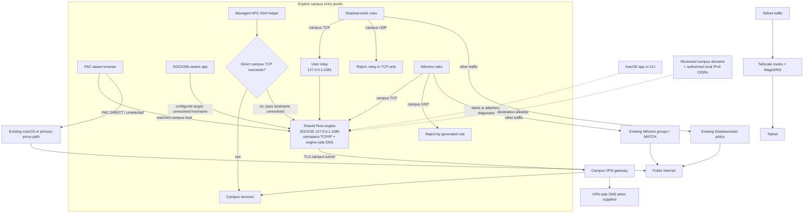

# Architecture

## Traffic ownership and coexistence

Traffic reaches the engine only through an application or rule that explicitly
selects the campus path. The app does not insert a system-wide traffic
classifier ahead of other network services.

The engine is not on the default Internet or tailnet traffic path and does not
inspect unselected traffic. The optional Shadowrocket Realtime/DNS repair
changes DNS, IPv6, and selected public-domain rules inside Shadowrocket, while
locally exported private CIDRs may add scoped routes inside the primary TUN.
Those integrations can increase the configuration overlap surface, but they do
not put unselected Internet or tailnet traffic through the campus engine.

`engine/` is the only implementation of authentication, tunnel framing, VPN
DNS, destination policy, and SOCKS5. The desktop app and CLI are lifecycle and
presentation layers; neither implements gateway protocol logic.

## Shared-engine contract

The local SOCKS listener is the coordination boundary. A frontend may attach
only when all of these checks pass:

1. exactly one process listens on the configured loopback port;
2. the process executable is an `ec-engine` build;
3. an approved campus hostname succeeds through SOCKS5 within a bounded time.

An unrelated listener or an unhealthy external engine is never killed. The
frontend reports the conflict and leaves ownership resolution to the user.
An attached frontend also cannot change the listener port: the owning
interface must stop its engine before another frontend persists a new endpoint.

Ownership is process-local:

- the app keeps its child-process handle and stops only that child;
- the CLI records the PID it spawned, verifies the PID still resolves to its
  selected engine executable, and stops only that PID;
- an attached frontend clears only its own UI/control state on disconnect.

This deliberately avoids a privileged daemon or global system networking.
A future structured control socket could expose richer health events, but must
retain the same authentication and ownership boundary.

The optional compatibility relay is persistent shared infrastructure rather
than frontend-owned session state. App and CLI mutations take the same
owner-only kernel `lockf` lease on the persistent
`~/.hkustgzconnect/compatibility-relay.lock` file. The lease remains held by an
open file descriptor for the full mutation and is released automatically when
that descriptor closes or its process exits. A concurrent install, rollback,
or remove operation fails clearly instead of overwriting shared state.

## Network coexistence contract

The engine is an application-scoped userspace path, not a second default-route
owner. In the default configuration it does not install a TUN interface, set a
system proxy, replace system DNS, or rewrite another network application's
configuration.

Integrations preserve that boundary:

- PAC and native SOCKS make the route choice in the consuming application;
- the Shadowrocket campus-only module keeps Shadowrocket as global policy
  owner and targets a user-level loopback relay only for campus rules;
- the Mihomo exporter produces a merge snippet and never edits subscriptions,
  DNS, groups, or the final `MATCH` policy;
- the app displays possible private-route capture but never changes Tailscale
  routes, MagicDNS, or exit-node state.

The optional Shadowrocket **Realtime/DNS repair** preset is outside the default
boundary because it changes DNS and IPv6 policy inside Shadowrocket. It is
explicit, reversible, and considered only after separate system/TUN and primary
SOCKS HTTPS checks produce the documented differential result. The affected
application, not the reachability probe, verifies persistent operation.

No frontend can guarantee coexistence when multiple TUNs advertise the same
CIDR or intercept the same DNS request. Generated configurations instead keep
the ownership decision visible: direct guards prevent the campus gateway and
engine from looping, campus UDP fails closed on TCP-only exported paths, and
locally supplied CIDRs remain explicit.

## State and credentials

| Data | Location | Owner |
| --- | --- | --- |
| CLI username/port | `~/.config/hkustgz-connect/config.toml` | user, mode 0600 |
| Shared private network policy | `~/.config/hkustgz-connect/policy.json` | user, mode 0600 |
| CLI password | macOS Keychain service `hkustgzconnect` | macOS |
| CLI log/PID/PAC | `~/.hkustgzconnect/` | user, mode 0600/0700 |
| Shared relay operation lock | `~/.hkustgzconnect/compatibility-relay.lock` | user, mode 0600 |
| App settings/credentials/logs | Electron user-data directory | user + OS secure storage |

The two frontends do not copy secrets between stores. They can attach to an
already authenticated engine without reading its credentials. If the owner
exits, an attached frontend can start a replacement only if that frontend has
its own saved credentials.

The tracked gateway profile contains public endpoints and domain suffixes
only. An optional local policy may replace only `vpn_dns_servers` and
`route_ipv4_cidrs`; the engine rejects other overlay keys. This keeps
campus-private topology out of source control while giving both frontends the
same network boundary.

## Failure behavior

- Listener existence alone is never reported as healthy.
- The engine performs an internal VPN-DNS keepalive and bounded reconnect.
- The app parses engine lifecycle messages and clears stale healthy status
  during internal recovery.
- The app and CLI both use active SOCKS probes for user-facing status.
- Private campus IPs fail closed when the engine is unavailable.

Detailed protocol boundaries are in [the engine architecture](../engine/ARCHITECTURE.md).
Integration ownership and setup are in [Network coexistence](NETWORK_COEXISTENCE.md).
